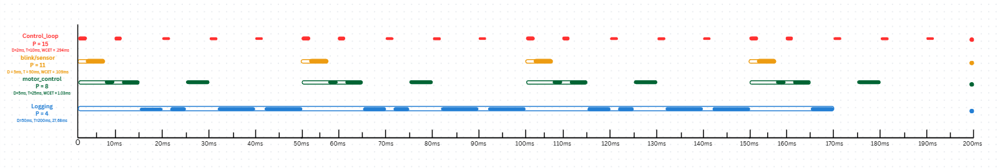
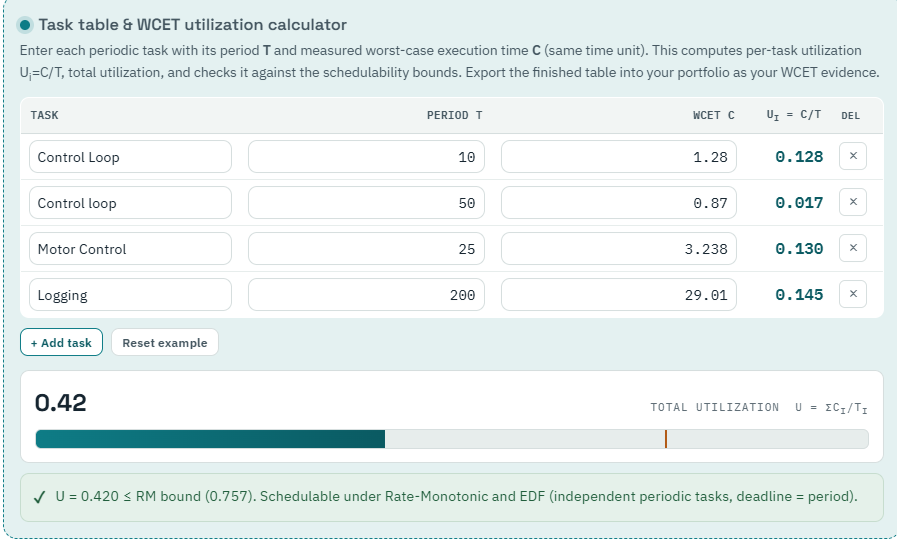

# MCO Airport Tram Controller - Real-Time Systems

## Project Overview
This is a themed theoretical application for my Real Time Systems class. The project connects RTOS to industrial motor control drivers found in the Orlando MCO Airport's Trams. This is not fully fleshed out with realistic data, but more of an exercise of designing deadlines and real time communications between ISR's and tasks.

## Important Links
Wokwi Project: https://wokwi.com/projects/471103920277954561
GitHub Pages: https://ajattc.github.io/
Youtube Video URL: https://youtu.be/Vozy7jiy3sM?si=Hmy82CkNsLV6xZVf
## LinkedIn: https://www.linkedin.com/in/adrian-james-/
### Theme
An industrial system that aims to control drivers and sensors, built to demonstrate real-time emergency and safety driver operations for a Control Engineer role.

### Background
The Orlando MCO Airport Tram system transports passengers from the main airport building to the various terminals where they board the plane. These trams travel back and forth autonomously (except for some overrides) and employ certain features used in real time systems. These function include: motor driver operations, sensor data processing, control loops, and various other safety and emergency operations. I chose this because I've been on these trams before and found them interesting and a simple real-time system which connects to my Real Time Systems Class. 

My final project builds off of Application 4 and coordination of Interrupt Service Routines and primitive handling for data in real time systems.

---

## System Architecture

---

## Demo Video
*(To embed a YouTube video, replace `YOUR_VIDEO_ID` with the actual ID from your YouTube link. If using Wokwi, you can paste the Wokwi embed code here instead.)*

<iframe width="1020" height="730" src="https://www.youtube.com/embed/Vozy7jiy3sM?si=Mp_RFb0iQ1-Vwx5C" title="YouTube video player" frameborder="0" allow="accelerometer; autoplay; clipboard-write; encrypted-media; gyroscope; picture-in-picture; web-share" referrerpolicy="strict-origin-when-cross-origin" allowfullscreen></iframe>

---

## Task Table & WCET Evidence

This project has 4 main tasks to simulate regular operation, listed in terms of decreasing priority: a vital control loop, sensor reading task, motor control task, and logging task. The tasks have simulated deadlines and periods as follows:

| Task | Function | Period (ms) | WCET measured (µs) | WCET + 30% margin (µs) | Deadline | Priority | Core |
|---|---|---:|---:|---:|---:|---:|---:|
| A | Control_loop | 10 | 1,281 | 1,665 | 2 ms | 15 | 1 |
| B | Blink/Sensor Read | 50 | 886 | 1,151 | 5 ms | 11 | 1 |
| C | Motor_control | 25 | 3,238 | 4,267 | 5 ms | 8 | 1 |
| D | Logging | 200 | 29,009 | 37,711 | 50 ms | 4 | 1 |

### Other Tasks and ISRs
Along with these tasks, there is a web server that serves to log important data like Worst Case Execution times and iterations of each of the 4 tasks. The webserver runs of core 0 to prevent interference with vital system operation. 

There is an accompanying button ISR for initiating an emergency stop(red) using a task notification and collecting a VFD data sample(black) using a counting semaphore. Each has their own bottom half ISR that is blocked until the semaphore is given.

---

## Hazard Analysis & Industry Standard Mapping

| Hazard | Potential Cause | Severity | RTOS Mitigation Strategy | Standard Mapping |
|--------|-----------------|----------|--------------------------|------------------|
| Task A Deadline Miss | High Priority Starvation | Critical | Strict priority assignments | IEC 61508 SIL 3 |
| E-Stop Failure | Missed Button Interrupt | Critical | Dedicated immediate ISR | ... |
| Sensor Disconnect | Hardware Failure | Moderate | Timeout handling in Task B | ... |
| Motor Data Mismatch | Corrupted Data | Moderate | Mutexes and Strict Deadlines | ... |

## Reflection

FINAL REFLECTION

#### What I would do differently
If I could do it all again, I would create more tailored functions and organize my tasks and calculations better since I did not initially anticipate this project to build. As more and more tasks and features were added, I found it harder and harder to pick up where I left off and would get lost in the code. I also did not use nearly enough readable comments to actually help guide future me through what each part of the program did, which caused a lot of frustration. So, I would organize my functions and create clear and concise divisions and sections for my tasks, ISR's, webserver, and variables.

#### What was harder than expected
Since I do not come from a coding background(I actually hate coding), it was honestly difficult to get over the learning curve of learning a new-ish language. While FreeRTOS is an extension of C programming, which i thought i knew, it still introduces massive amounts of new functions, syntaxes and possibilities for how you can implement it. This made these applications much harder to actually implement since I would often be lost on how to correctly format my semaphores, mutexes, and tasks.

#### The most valuable thing I learned
One of the most valuable things I will take with me to future industry prospects is the design of Real Time Systems and task mapping. More importantly, understanding the role of AI in generating and debugging code for these programs. I personally do not know many coding languages, but AI knows essentially all of them and can create large bulks of code to perform what I need and allow me to fine tune it to my project. Task scheduling and utilization of RTOS primitives were among the most important aspects of this class i learned and truly put into context how multi-threaded and complex systems do work.
